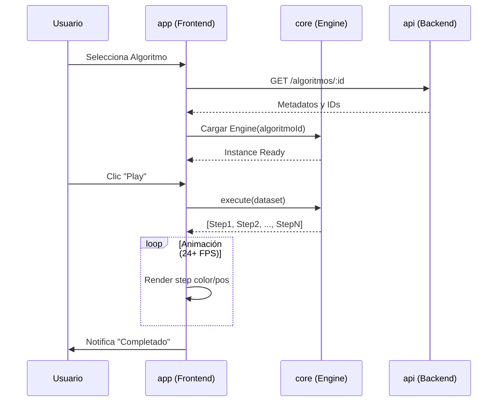

# Library & Simulation Specification

> **Fuente de verdad**: `BrainSort-Historias_de_Usuario.docx` (HU-01 a HU-07), `BrainSort-Contratos.docx`, `BrainSort-Glosario.docx`

## 1. Context & Motivation
La propuesta de valor central de BrainSort es visualizar algoritmos interactuando con datos. Un diccionario estático no es suficiente. Se necesita un motor que resuelva dinámicamente los pasos de un arreglo siendo ordenado.

## 0. Ciclo de Vida de una Simulación

A continuación se muestra el flujo técnico desde que el usuario elige un algoritmo hasta que finaliza la animación:




## 2. User Experience (UX) — Según Historias de Usuario

### HU-01: Navegar la Biblioteca
- Pantalla principal tipo "Dashboard" o "Biblioteca".
- Algoritmos agrupados por categorías (ej. Ordenamiento, Búsqueda, Estructuras Lineales).
- Cada tarjeta de algoritmo muestra: nombre, nivel de dificultad (visual, colores o estrellas), descripción corta (máx. 140 caracteres).
- Al hacer clic en una categoría, se expanden o muestran solo los algoritmos de esa categoría.
- Si búsqueda no arroja resultados: "No se encontraron algoritmos con ese criterio".
- **Métricas**: Tiempo de navegación hasta seleccionar algoritmo < 15 segundos.
- Usar Lazy Loading para imágenes de tarjetas.

### HU-02: Seleccionar un Algoritmo
- Clic/tap en tarjeta redirige a vista de detalle/simulación.
- Indicador de progreso ("spinner" temático) durante carga.
- Vista destino muestra título del algoritmo en cabecera.
- Si módulo marcado "Próximamente": modal informativo, no redirigir.

### HU-03: Datos Predeterminados
- Al cargar pantalla, área de visualización NO debe estar vacía.
- Generar arreglo aleatorio de **8 a 15 elementos** (números enteros).
- Datos representados visualmente (barras de altura proporcional al valor).
- Datos generados no deben estar ya ordenados ni vacíos.
- Control de "generar nuevos datos" integrado como botón de dado dentro del input de datos personalizados.
- El input de datos personalizados debe reflejar siempre el dataset activo: datos iniciales, datos generados y datos aplicados manualmente.

### HU-04: Controlar y Visualizar la Animación
- Barra de control con botón "Play/Pausa".
- **Color Coding (según Constitution del proyecto)**:
  - Azul: Elemento inactivo / base.
  - Amarillo: Comparando.
  - Rojo: Intercambiando.
  - Verde: Posición final correcta.
  > *Nota: La HU-04 original menciona "rojo para comparar, verde para intercambiar" como ejemplos. El esquema de 4 colores es la extensión oficial del proyecto.*
- Animación fluida (sin saltos bruscos).
- Resaltar visualmente elementos procesándose en el instante actual.
- Capacidad de ajustar velocidad en rango **[0.25x, 2.0x]** en incrementos de 0.25x (según Glosario). La HU-04 menciona 0.5x, 1x, 2x como ejemplos representativos.
- **Rendimiento**: 24 FPS o más en dispositivos de gama media/baja.

### HU-06: Seguimiento hasta Finalización
- Animación no se detiene prematuramente (a menos que el usuario pause).
- Al finalizar: todos los elementos cambian a estado "Completado" (color verde uniforme).
- Controles deshabilitan "Play" y habilitan "Reiniciar".
- Timeout de seguridad si se detecta bucle infinito.
- Feedback visual de completitud claro para daltónicos (iconos además de color).

### HU-07: Mensaje de Finalización
- Al concluir animación: notificación no intrusiva "¡Algoritmo completado!".
- Opciones rápidas: "Reiniciar", "Siguiente Algoritmo", "Ver Código".
- Desaparece automáticamente después de 5 segundos si no hay interacción.

## 3. Core Requirements

**In-Scope:**
- Biblioteca de algoritmos categorizada con tarjetas descriptivas.
- La biblioteca debe poder crecer por fases. La línea base expandida contiene 14 elementos activos: Bubble Sort, Insertion Sort, Selection Sort, Linked List, Queue, Stack, Merge Sort, Quick Sort, Heap Sort, Binary Search, Linear Search, Deque, Priority Queue y Segment Tree.
- La expansión de contenido no debe romper el contrato `GET /api/biblioteca`, manteniendo `nombre`, `descripcion`, `dificultad`, `complejidadTiempo`, `complejidadEspacio`, `categoria` y `tags`.
- Cada algoritmo nuevo debe tener engine auto-contenido cuando sea simulable: `meta`, `pseudocode` y `execute(data)`.
- Motor de simulación visual paso a paso con controles Play/Pausa.
- Velocidad ajustable en rango **[0.25x, 2.0x]** en incrementos de 0.25x (según Glosario).
- Datos de entrada: **Predeterminados** (auto-generados) y **Personalizados** (del usuario) — según Modelo del Dominio.
- El control de datos personalizados muestra el dataset activo en formato CSV y permite regenerarlo desde un botón de dado embebido en el campo.
- La línea base implementada expone consulta de biblioteca y detalle de algoritmo. El CRUD administrativo de algoritmos queda como extensión planificada y no forma parte de los endpoints actuales verificados en U4-EJ26.

### 3.1 Expansión del Catálogo de Algoritmos

La expansión debe priorizar algoritmos y estructuras que aporten variedad pedagógica y que puedan conectarse a ejercicios predictivos.

**Catálogo objetivo mínimo de la siguiente fase:**

| Categoría | Algoritmos/Estructuras a agregar | Requisito de simulación |
|---|---|---|
| Ordenamiento | Merge Sort, Quick Sort, Heap Sort | Engine visual paso a paso obligatorio |
| Búsqueda | Binary Search, Linear Search | Engine visual paso a paso obligatorio |
| Estructuras Lineales | Deque, Priority Queue | Engine o visualización operacional obligatoria |
| Estructuras de Árboles | Segment Tree | Engine visual paso a paso obligatorio con nodos explícitos |

**Criterios de aceptación:**

- `GET /api/biblioteca` debe retornar los nuevos elementos activos junto con los 6 existentes.
- Los filtros por categoría y búsqueda deben cubrir nombres, categorías y tags de los nuevos elementos.
- Ningún algoritmo nuevo puede aparecer en la biblioteca si no tiene al menos:
  - metadatos completos,
  - tags,
  - dificultad,
  - descripción de máximo 140 caracteres,
  - ejercicios asociados en formatos cerrados o semi-cerrados.
- Los algoritmos marcados como "Próximamente" pueden existir en base de datos, pero deben ser `activo = false` o mostrar estado no navegable en UI.

### 3.2 Visualización Enriquecida por Datos

La simulación no debe depender de etiquetas hardcodeadas en el frontend. Cada algoritmo puede persistir una configuración `visualizacion` en DB con roles, colores y etiquetas por línea de pseudocódigo.

**Reglas actuales:**

- Los pasos pueden incluir `marcadores[]` con `index`, `label`, `role` y `color`.
- Las barras deben mostrar el texto de la variable activa (`i`, `j`, `pivot`, `mid`, `key`, etc.) usando `marcadores[]`.
- Las llamadas recursivas en espera deben representarse con `role = "esperaRecursion"` y color configurado en DB.
- Las visualizaciones de árbol pueden incluir `nodosArbol[]` para no inferir el layout desde un arreglo plano.
- Segment Tree debe usar `nodosArbol[]` con `index`, `value`, `level`, `position` y `label` de rango (`[inicio,fin]`).
- `PseudocodePanel` debe mantener visible la línea activa al cambiar de paso, calculando la posición real de la línea dentro del panel y no solo el número de línea.

### 3.3 Pseudocódigo de Merge Sort

Merge Sort debe exponer el paso `Merge` con detalle suficiente para comprender la combinación de mitades, no solo como una llamada opaca:

```text
1 MergeSort(arreglo, L, R)
2   Si L == R: retornar
3   M = piso((L + R) / 2)
4   MergeSort(arreglo, L, M)
5   MergeSort(arreglo, M + 1, R)
6   Merge(arreglo, L, M, R)
7     izq = copia de arreglo[L..M]
8     der = copia de arreglo[M+1..R]
9     i = 0; j = 0; k = L
10    Mientras i < tam(izq) y j < tam(der)
11      Si izq[i] <= der[j]: arreglo[k] = izq[i]; i++
12      Si no: arreglo[k] = der[j]; j++
13      k++
14    Copiar sobrantes de izq o der al arreglo
```

### 3.4 Pseudocódigo de Segment Tree

Segment Tree debe mostrar exclusivamente el pseudocódigo de construcción cuando la simulación ejecuta `build`:

```text
1 build(nodo, inicio, fin)
2   Si inicio == fin: tree[nodo] = arreglo[inicio]
3   mid = piso((inicio + fin) / 2)
4   build(2*nodo, inicio, mid)
5   build(2*nodo+1, mid+1, fin)
6   tree[nodo] = tree[2*nodo] + tree[2*nodo+1]
7   retornar tree[nodo]
```

No se deben mezclar líneas de `query` en esta simulación de construcción.

**Out-of-Scope:**
- Algoritmos de grafos avanzados (A*, Dijkstra, Bellman-Ford) hasta que exista una visualización de grafos dedicada.

## 4. Contratos de Operación (Según BrainSort-Contratos.docx)
- **CO1 - getLibrary()**: Crea instancia de BibliotecaDeAlgoritmos, lista de algoritmos con descripciones, tarjeta por algoritmo, rutas de aprendizaje. (Pre: Se solicitó la biblioteca).
- **CO2 - getAlgoritmo()**: Crea instancia del algoritmo, asocia avance con cuenta actual. (Pre: Se seleccionó un algoritmo).
- **CO3 - getSimulation()**: Crea instancia de simulación del algoritmo, asocia avance en simulación con cuenta actual. (Pre: Se seleccionó mostrar simulación).

## 5. Edge Cases & Error Handling (Según HUs)
- Sin conexión: mostrar solo algoritmos cacheados, indicar "Sin conexión".
- Error de carga: mensaje claro con opciones de recuperación.
- Error en visualización (animación congelada): permitir reiniciar o reportar fallo.
- Datos personalizados inválidos: error si formato no coincide o valores nulos.
