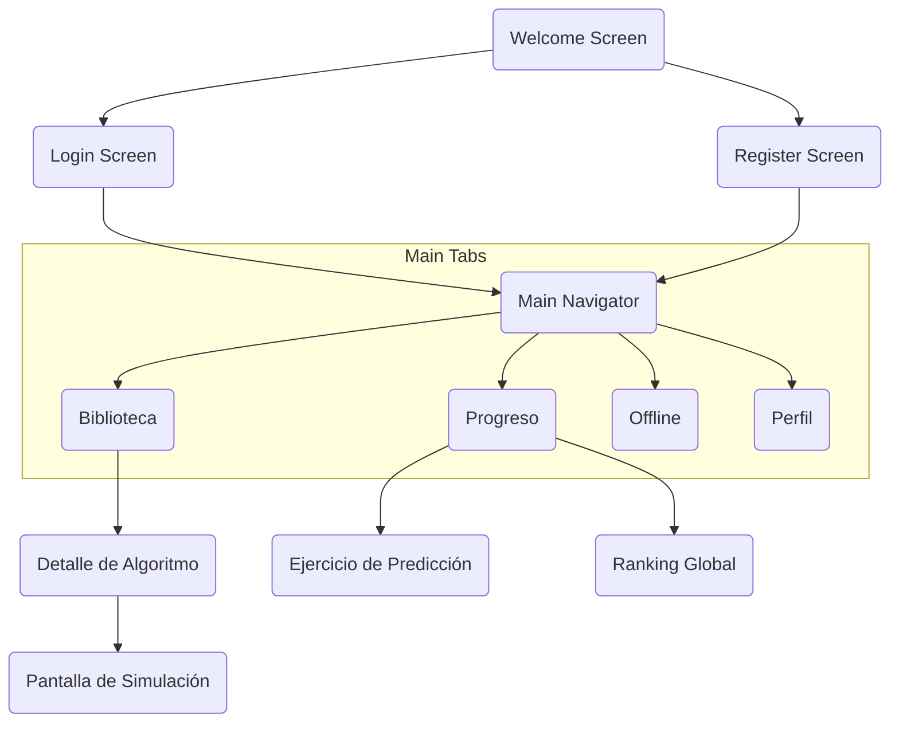

# 02 — Frontend App (`brainsort-app`)

> **Repositorio**: https://github.com/BrainSort/brainsort-app
> **Framework**: React Native + Expo + React Native Web
> **Patrón**: MVVM con Custom Hooks (ViewModel)
> **Lenguaje**: TypeScript
> **Arquitectura interna**: Clean Architecture — lógica de algoritmos en `packages/core`

---

## 0. Mapa de Navegación (User Flow)

Este diagrama muestra cómo el usuario fluye a través de las pantallas de la aplicación:



---


---

## 1. Estructura de Carpetas (Según Doc. Arquitectura §4.3)

```
brainsort-app/
├── .github/
│   └── workflows/
│       └── ci.yml                     # Lint, test, typecheck en cada PR
├── packages/
│   └── core/                          # ← NÚCLEO: Lógica pura, sin dependencias de UI
│       ├── src/
│       │   ├── engines/               # Implementaciones de algoritmos de ordenamiento
│       │   │   ├── bubble-sort.ts
│       │   │   ├── selection-sort.ts
│       │   │   ├── insertion-sort.ts
│       │   │   ├── merge-sort.ts
│       │   │   └── engine.interface.ts  # Interfaz SortEngine
│       │   ├── math/                  # Utilidades matemáticas D3.js
│       │   │   ├── scales.ts          # d3.scaleLinear() para mapear valores → coordenadas
│       │   │   ├── transitions.ts     # Cálculos de interpolación para animaciones
│       │   │   └── coordinates.ts     # Generación de coordenadas SVG para barras
│       │   ├── types/                 # Tipos compartidos
│       │   │   ├── simulation.types.ts
│       │   │   ├── algorithm.types.ts
│       │   │   └── step.types.ts
│       │   ├── validators/            # Validación de datos de entrada
│       │   │   └── dataset.validator.ts
│       │   └── index.ts               # Barrel export
│       ├── package.json
│       └── tsconfig.json
│
├── src/
│   ├── assets/                        # Recursos estáticos
│   │   ├── fonts/                     # Tipografías custom
│   │   ├── icons/                     # Iconos SVG
│   │   └── images/                    # Imágenes de la app
│   │
│   ├── components/                    # Componentes reutilizables de UI
│   │   ├── common/                    # Botones, inputs, cards genéricos
│   │   │   ├── Button.tsx
│   │   │   ├── Card.tsx
│   │   │   ├── Input.tsx
│   │   │   ├── Spinner.tsx            # Indicador de carga temático (HU-02)
│   │   │   ├── Toast.tsx              # Notificación no intrusiva (HU-07)
│   │   │   └── Modal.tsx
│   │   ├── algorithm/                 # Componentes específicos de algoritmos
│   │   │   ├── AlgorithmCard.tsx       # Tarjeta: nombre, dificultad, descripción ≤140 chars (HU-01)
│   │   │   ├── CategoryFilter.tsx     # Filtro por categoría (HU-01)
│   │   │   └── DifficultyBadge.tsx    # Indicador visual de dificultad
│   │   ├── simulation/                # Componentes del motor visual
│   │   │   ├── SimulationCanvas.tsx   # Contenedor SVG principal
│   │   │   ├── Bar.tsx                # Barra individual (react-native-svg Rect)
│   │   │   ├── BarChart.tsx           # Conjunto de barras renderizadas
│   │   │   ├── ControlBar.tsx         # Play/Pausa, velocidad, reiniciar (HU-04)
│   │   │   ├── SpeedSlider.tsx        # Control de velocidad [0.25, 2.0] (Glosario)
│   │   │   ├── StepIndicator.tsx      # Muestra paso actual / total
│   │   │   ├── PseudocodePanel.tsx    # Panel de pseudocódigo sincronizado (Glosario)
│   │   │   ├── ComplexityInfo.tsx     # Muestra Big O del algoritmo
│   │   │   └── CompletionOverlay.tsx  # Overlay de "¡Completado!" (HU-07)
│   │   ├── gamification/              # Componentes de gamificación
│   │   │   ├── PredictionExercise.tsx # Ejercicio de predicción interactivo
│   │   │   ├── PointsBanner.tsx       # Muestra puntos y nivel
│   │   │   ├── StreakCounter.tsx      # Contador de racha de días
│   │   │   ├── BadgeCard.tsx          # Tarjeta de insignia
│   │   │   └── LeaderboardRow.tsx     # Fila del ranking
│   │   ├── offline/                   # Componentes de offline
│   │   │   ├── OfflineModuleCard.tsx  # Tarjeta de módulo descargable
│   │   │   ├── DownloadProgress.tsx   # Barra de progreso de descarga
│   │   │   └── SyncStatusBanner.tsx   # Estado de sincronización
│   │   └── layout/                    # Componentes de layout
│   │       ├── Header.tsx
│   │       ├── BottomTabBar.tsx
│   │       └── SafeAreaWrapper.tsx
│   │
│   ├── screens/                       # Pantallas completas de la aplicación
│   │   ├── auth/
│   │   │   ├── LoginScreen.tsx
│   │   │   ├── RegisterScreen.tsx
│   │   │   └── WelcomeScreen.tsx      # Pantalla de bienvenida
│   │   ├── library/
│   │   │   ├── LibraryScreen.tsx      # Dashboard/Biblioteca principal (HU-01)
│   │   │   └── AlgorithmDetailScreen.tsx  # Vista de detalle + entorno de simulación (HU-02)
│   │   ├── simulation/
│   │   │   └── SimulationScreen.tsx   # Pantalla de simulación interactiva (HU-03, HU-04, HU-06)
│   │   ├── gamification/
│   │   │   ├── ExerciseScreen.tsx     # Pantalla de ejercicio de predicción
│   │   │   ├── ProgressScreen.tsx     # Progreso del usuario
│   │   │   └── LeaderboardScreen.tsx  # Ranking global
│   │   ├── offline/
│   │   │   └── OfflineManagerScreen.tsx  # Gestor de módulos offline
│   │   └── profile/
│   │       ├── ProfileScreen.tsx      # Perfil del usuario
│   │       └── SettingsScreen.tsx     # Configuración
│   │
│   ├── navigation/                    # Configuración de navegación
│   │   ├── AppNavigator.tsx           # Navigator raíz (auth vs main)
│   │   ├── AuthNavigator.tsx          # Stack: Login → Register
│   │   ├── MainTabNavigator.tsx       # Bottom tabs: Biblioteca | Progreso | Offline | Perfil
│   │   └── LibraryStackNavigator.tsx  # Stack: Library → Detail → Simulation
│   │
│   ├── hooks/                         # Custom Hooks (ViewModel en MVVM)
│   │   ├── useAuth.ts                 # Login, register, logout, token management
│   │   ├── useLibrary.ts              # Fetch biblioteca, filtrar por categoría
│   │   ├── useAlgorithm.ts            # Fetch detalle de algoritmo
│   │   ├── useSimulation.ts           # Estado de simulación: play/pause, velocidad, paso actual
│   │   ├── useSimulationEngine.ts     # Ejecuta engine de packages/core, genera pasos
│   │   ├── useAnimationController.ts  # Controla timing de animaciones con requestAnimationFrame
│   │   ├── useExercise.ts             # Fetch y responder ejercicios
│   │   ├── useProgress.ts            # Progreso, ranking, insignias
│   │   ├── useOfflineModules.ts       # Descargar/eliminar módulos offline
│   │   ├── useSync.ts                 # Sincronización de progreso offline
│   │   └── useDataset.ts             # Generación y validación de conjuntos de datos
│   │
│   ├── services/                      # Comunicación con brainsort-api
│   │   ├── api.ts                     # Instancia base de fetch/axios con interceptores
│   │   ├── auth.service.ts            # POST /auth/register, POST /auth/login
│   │   ├── library.service.ts         # GET /biblioteca, GET /algoritmos/:id
│   │   ├── simulation.service.ts      # POST /simulaciones
│   │   ├── exercise.service.ts        # GET /ejercicios/:algoId, POST /ejercicios/:id/responder
│   │   ├── progress.service.ts        # GET /progreso/me, GET /ranking
│   │   ├── badges.service.ts          # GET /insignias, GET /insignias/me
│   │   ├── offline.service.ts         # GET /modules/offline
│   │   └── sync.service.ts            # POST /progress/sync
│   │
│   ├── context/                       # Estado global con React Context
│   │   ├── AuthContext.tsx             # Usuario actual, tokens, rol
│   │   ├── SimulationContext.tsx       # Estado de simulación activa
│   │   └── ThemeContext.tsx            # Tema visual (dark/light)
│   │
│   ├── visualization/                 # Motor de renderizado visual
│   │   ├── BarRenderer.tsx            # Renderiza barras SVG con react-native-svg
│   │   ├── AnimationEngine.ts         # Orquesta transiciones entre pasos
│   │   ├── ColorMapper.ts             # Mapea tipoOperacion → color (azul/amarillo/rojo/verde)
│   │   └── AccessibilityIcons.tsx     # Íconos adicionales para daltónicos (HU-06)
│   │
│   ├── storage/                       # Persistencia local (Offline-First)
│   │   ├── sqlite/                    # Móvil: expo-sqlite
│   │   │   ├── database.ts            # Inicialización de SQLite
│   │   │   ├── modules.dao.ts         # CRUD módulos descargados
│   │   │   └── pending-sync.dao.ts    # Cola de sincronización pendiente
│   │   ├── indexeddb/                 # Web: IndexedDB
│   │   │   ├── database.ts            # Inicialización de IndexedDB
│   │   │   ├── modules.store.ts
│   │   │   └── pending-sync.store.ts
│   │   └── storage.adapter.ts         # Adaptador: detecta plataforma → SQLite o IndexedDB
│   │
│   ├── sandbox/                       # Ejecución segura de código de usuario
│   │   ├── WebViewSandbox.tsx         # Móvil: react-native-webview
│   │   ├── WorkerSandbox.ts           # Web: Web Workers
│   │   └── sandbox.adapter.ts         # Adaptador por plataforma
│   │
│   ├── styles/                        # Estilos globales y tokens de diseño
│   │   ├── colors.ts                  # Paleta de colores (incluyendo simulación)
│   │   ├── typography.ts              # Tipografías
│   │   ├── spacing.ts                 # Sistema de espaciado
│   │   └── theme.ts                   # Tema unificado Web/Móvil
│   │
│   ├── utils/                         # Utilidades generales
│   │   ├── platform.ts                # Detección de plataforma (web/ios/android)
│   │   ├── formatters.ts              # Formateo de números, fechas
│   │   └── validators.ts              # Validaciones de UI
│   │
│   └── generated/                     # Tipos auto-generados desde Swagger
│       └── api-types.ts               # Generado por openapi-typescript
│
├── app.json                           # Configuración de Expo
├── eas.json                           # Configuración de EAS Build
├── babel.config.js
├── metro.config.js
├── package.json
└── tsconfig.json
```

---

## 2. Patrón MVVM con Custom Hooks

```
┌──────────────────────────────────────────────────────────────┐
│  Screen (View)                                                │
│  ┌──────────────────┐                                        │
│  │ SimulationScreen │                                        │
│  │ • Renderiza UI    │                                        │
│  │ • No tiene lógica │                                        │
│  └────────┬─────────┘                                        │
│           │ usa                                               │
│  ┌────────▼──────────┐                                       │
│  │ useSimulation()   │ ← Custom Hook (ViewModel)             │
│  │ • play/pause       │                                       │
│  │ • currentStep      │                                       │
│  │ • speed             │                                       │
│  │ • bars[]            │                                       │
│  └────────┬──────────┘                                       │
│           │ usa                                               │
│  ┌────────▼──────────┐   ┌─────────────────────┐            │
│  │ simulation.service│   │ packages/core        │            │
│  │ (API calls)       │   │ (Lógica pura)       │ ← Model    │
│  └───────────────────┘   └─────────────────────┘            │
└──────────────────────────────────────────────────────────────┘
```

**Regla**: Los Screens **nunca** contienen lógica de negocio. Solo consumen hooks y renderizan.

---

## 3. Flujo de Pantallas (Según Historias de Usuario)

### 3.1 Navegación Principal
```
AppNavigator
├── AuthNavigator (no autenticado)
│   ├── WelcomeScreen
│   ├── LoginScreen
│   └── RegisterScreen
│
└── MainTabNavigator (autenticado)
    ├── Tab: Biblioteca
    │   └── LibraryStackNavigator
    │       ├── LibraryScreen           ← HU-01: Dashboard/Biblioteca
    │       ├── AlgorithmDetailScreen   ← HU-02: Detalle + entorno de aprendizaje
    │       └── SimulationScreen        ← HU-03, HU-04, HU-06, HU-07
    │
    ├── Tab: Progreso
    │   ├── ProgressScreen             ← Gamificación
    │   ├── ExerciseScreen              ← Ejercicios de predicción
    │   └── LeaderboardScreen           ← Ranking
    │
    ├── Tab: Offline
    │   └── OfflineManagerScreen        ← Gestor de módulos
    │
    └── Tab: Perfil
        ├── ProfileScreen
        └── SettingsScreen
```

### 3.2 Flujo de Simulación (HU-01 → HU-07)

```
1. LibraryScreen
   ├── Muestra categorías: Ordenamiento, Búsqueda, Estructuras Lineales (HU-01)
   ├── Tarjetas con: nombre, dificultad, descripción ≤140 chars (HU-01)
   ├── Filtros por categoría (HU-01)
   ├── Lazy Loading de imágenes (HU-01 notas técnicas)
   └── Responsive: adapta columnas según ancho (HU-01 DoD)

2. AlgorithmDetailScreen
   ├── Muestra título en cabecera (HU-02)
   ├── Spinner temático durante carga (HU-02)
   ├── Si "Próximamente" → modal informativo (HU-02 flujo alt.)
   ├── Contenido teórico introductorio
   └── Botón "Iniciar Simulación"

3. SimulationScreen
   ├── Carga datos predeterminados: arreglo aleatorio 8-15 elementos (HU-03)
   ├── Barras de altura proporcional al valor (HU-03)
   ├── Input de datos personalizados sincronizado con el dataset activo
   ├── Botón de dado embebido en el input para generar nuevos datos (HU-03 flujo alt.)
   ├── Barra de control: Play/Pausa (HU-04)
   ├── Colores: Azul(base), Amarillo(comparar), Rojo(intercambiar), Verde(final)
   ├── Slider de velocidad: [0.25, 2.0] × 0.25 (Glosario)
   ├── Panel de pseudocódigo sincronizado con paso actual y auto-scroll a la línea activa
   ├── Animación fluida ≥24 FPS (HU-04 DoD)
   ├── Timeout de seguridad contra bucles infinitos (HU-06)
   ├── Al finalizar: todos verdes + ícono ✓ para daltónicos (HU-06)
   ├── Deshabilita Play, habilita Reiniciar (HU-06)
   ├── Toast/Modal: "¡Algoritmo completado!" con opciones (HU-07)
   │   ├── "Reiniciar"
   │   ├── "Siguiente Algoritmo"
   │   └── "Ver Código"
   └── Toast auto-desaparece a los 5 segundos (HU-07)
```

---

## 4. Motor de Visualización (`visualization/`)

### Arquitectura del Renderizado
```
packages/core (D3.js - puro matemático)
    │
    ├── Calcula coordenadas X, Y, Width, Height de cada barra
    ├── Calcula escalas: d3.scaleLinear(domain, range)
    ├── Calcula transiciones: interpolación entre estados
    │
    └── Retorna: BarData[] { x, y, width, height, color, value }
              │
              ▼
visualization/ (react-native-svg - renderizado)
    │
    ├── BarRenderer.tsx: Mapea BarData[] → <Rect> SVG
    ├── AnimationEngine.ts: requestAnimationFrame loop
    │   └── Avanza pasos según velocidadReproducción
    ├── ColorMapper.ts: tipoOperacion → colores Constitution
    │   ├── 'idle'        → #4A90D9 (Azul)
    │   ├── 'comparacion'  → #F5A623 (Amarillo)
    │   ├── 'intercambio'  → #D0021B (Rojo)
    │   └── 'final'        → #7ED321 (Verde)
    └── AccessibilityIcons.tsx: Íconos SVG superpuestos
        ├── comparacion  → 🔍 (lupa)
        ├── intercambio  → ↔️ (flechas)
        └── final        → ✓ (check)
```

### Flujo de una Animación
1. `useSimulationEngine` solicita `POST /api/simulaciones` y recibe `SimulationStep[]`, `pseudocode[]`, `marcadores[]` y, cuando aplica, `nodosArbol[]`.
2. `useAnimationController` usa `requestAnimationFrame` para avanzar por los pasos.
3. En cada frame: calcula las coordenadas de barras o estructura según la categoría del algoritmo.
4. `BarChart`, `LinearStructureCanvas` o `TreeStructureCanvas` re-renderizan el estado con colores y etiquetas desde `marcadores[]`.
5. `PseudocodePanel` resalta la línea correspondiente a `lineaPseudocodigo` y hace scroll al índice real de esa línea para mantenerla visible.

Para Segment Tree y futuras estructuras de árbol, el frontend debe usar `nodosArbol[]` como layout explícito en vez de inferir un heap completo desde `estadoArray`.

**Rendimiento**: D3.js solo calcula números (nunca toca el DOM). react-native-svg renderiza de forma nativa en ambas plataformas. El hilo principal nunca se bloquea.

---

## 5. Persistencia Local — Offline-First (`storage/`)

### Adaptador por Plataforma
```typescript
// storage.adapter.ts
import { Platform } from 'react-native';

export function getStorageAdapter() {
  if (Platform.OS === 'web') {
    return new IndexedDBAdapter();
  } else {
    return new SQLiteAdapter(); // expo-sqlite
  }
}
```

### Datos almacenados localmente
| Dato | Móvil (SQLite) | Web (IndexedDB) |
|---|---|---|
| Módulos descargados (JSON) | ✅ | ✅ |
| Módulos WASM binarios | ✅ (solo Android, expo-file-system) | ✅ (WebAssembly.instantiate) |
| Progreso pendiente de sync | ✅ | ✅ |
| Tokens JWT | expo-secure-store | HttpOnly cookies |
| Caché de API | TanStack Query | TanStack Query |

### Cola de Sincronización
```typescript
// PendingSync entity (local)
interface PendingSync {
  id: string;          // UUID local
  tipo: 'session' | 'exercise_attempt';
  payload: object;     // Datos a sincronizar
  fechaCreacion: Date;
  sincronizado: boolean;
}
```

Al recuperar conexión:
1. `useSync` detecta conectividad via `NetInfo`.
2. Consulta cola de `PendingSync` donde `sincronizado === false`.
3. Envía batch a `POST /api/progress/sync`.
4. Marca como `sincronizado = true` al recibir 200 OK.

---

## 6. Sandbox — Ejecución de Código de Usuario (`sandbox/`)

### Móvil: react-native-webview
```typescript
// WebViewSandbox.tsx
<WebView
  source={{ html: sandboxHTML }}
  javaScriptEnabled={true}
  originWhitelist={['*']}
  onMessage={(event) => {
    // Recibir resultado del código ejecutado
    const result = JSON.parse(event.nativeEvent.data);
    onResult(result);
  }}
/>
```

### Web: Web Workers
```typescript
// WorkerSandbox.ts
const worker = new Worker(new URL('./sandbox.worker.ts', import.meta.url));
worker.postMessage({ code: userCode, timeout: 10000 });
worker.onmessage = (event) => onResult(event.data);
```

**Plataforma WASM (solo Android)**:
- C++/Python compilados con Emscripten → `.wasm`
- Cargados dentro del WebView sandbox
- iOS: Solo JS/TS vía react-native-webview (sin WASM por restricciones Apple)

---

## 7. Generación de Tipos desde Swagger

```bash
# Regenerar tipos TypeScript desde el contrato del backend
npx openapi-typescript https://brainsort-api.railway.app/api/docs-json \
  --output src/generated/api-types.ts
```

Los services consumen estos tipos:
```typescript
// library.service.ts
import type { paths } from '../generated/api-types';

type BibliotecaResponse = paths['/api/biblioteca']['get']['responses']['200']['content']['application/json'];
```

---

## 8. Dependencias Principales (`package.json`)

```json
{
  "dependencies": {
    "expo": "~51.x",
    "react-native": "0.74.x",
    "react-native-web": "~0.19.x",
    "react-native-svg": "^15.x",
    "react-native-webview": "^13.x",
    "d3-scale": "^4.x",
    "d3-interpolate": "^3.x",
    "@tanstack/react-query": "^5.x",
    "@react-navigation/native": "^6.x",
    "@react-navigation/bottom-tabs": "^6.x",
    "@react-navigation/native-stack": "^6.x",
    "expo-sqlite": "~14.x",
    "expo-file-system": "~17.x",
    "expo-secure-store": "~13.x",
    "expo-font": "~12.x"
  },
  "devDependencies": {
    "typescript": "^5.x",
    "openapi-typescript": "^7.x",
    "eslint": "^8.57.0",
    "eslint-config-expo": "^7.x",
    "prettier": "^3.x"
  }
}
```

---

## 9. Responsive Design (HU-01 DoD)

```typescript
// hooks/useResponsiveColumns.ts
import { useWindowDimensions } from 'react-native';

export function useResponsiveColumns() {
  const { width } = useWindowDimensions();
  if (width >= 1024) return 4;  // Desktop
  if (width >= 768) return 3;   // Tablet
  if (width >= 480) return 2;   // Phablet
  return 1;                      // Phone
}
```

Todos los screens usan este hook para adaptar el layout (grid de tarjetas, panel de simulación, etc.).

---

## 10. Métricas de Éxito (Desde las HU)

| Métrica | Objetivo | HU |
|---|---|---|
| Tiempo de navegación → seleccionar algoritmo | < 15 segundos | HU-01 |
| Tasa de error en carga de página | < 0.1% | HU-02 |
| FPS en animación | ≥ 24 FPS en gama media/baja | HU-04 |
| Accesibilidad visual | Íconos + colores para daltónicos | HU-06 |
| Notificación de completitud | Auto-desaparece en 5 segundos | HU-07 |
