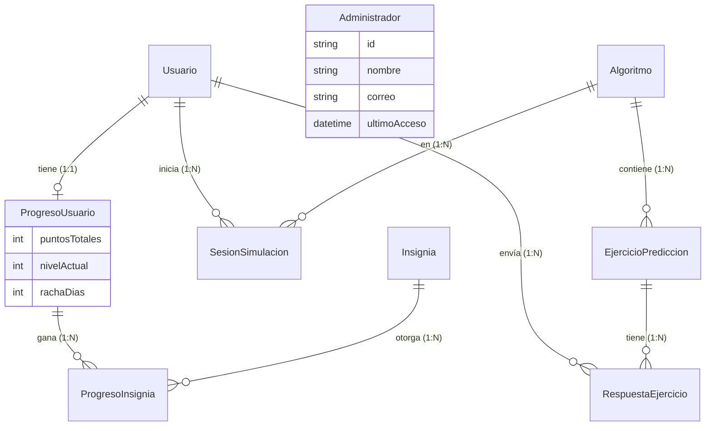

# 03 — Base de Datos (Prisma Schema)

> **Repositorio**: `brainsort-api` (carpeta `prisma/`)
> **Motor**: PostgreSQL v15+
> **ORM**: Prisma (única capa de acceso a datos)
> **Fuente de verdad**: `BrainSort-Modelo_del_Dominio.docx`, `BrainSort-Modelo_del_Dominio.uml`

---

## 0. Diagrama de Entidad-Relación (ERD)

Este diagrama visualiza las relaciones entre los modelos definidos en el esquema de Prisma:




---

## 1. Esquema Prisma Completo

```prisma
// prisma/schema.prisma

generator client {
  provider = "prisma-client-js"
}

datasource db {
  provider = "postgresql"
  url      = env("DATABASE_URL")
}

// ═══════════════════════════════════════
// Entidad: Usuario
// Modelo del Dominio: nombre, correo, rol, contraseña
// Asociaciones: utiliza BrainSort, visualiza Simulación,
//               completa EjercicioPredicción, tiene ProgresoUsuario
// ═══════════════════════════════════════
model Usuario {
  id          String   @id @default(uuid())
  nombre      String
  correo      String   @unique
  rol         Rol      @default(Estudiante)
  contrasena  String   // BCrypt hashed
  createdAt   DateTime @default(now())
  updatedAt   DateTime @updatedAt

  // Relaciones
  progreso    ProgresoUsuario?
  sesiones    SesionSimulacion[]
  respuestas  RespuestaEjercicio[]

  @@map("usuarios")
}

enum Rol {
  Estudiante
  Profesor
  Autodidacta
}

// ═══════════════════════════════════════
// Entidad: Administrador
// Modelo del Dominio: credencialesAdmin, últimoAcceso
// Asociación: gestiona Algoritmo
// ═══════════════════════════════════════
model Administrador {
  id                String   @id @default(uuid())
  nombre            String
  correo            String   @unique
  contrasena        String   // BCrypt hashed
  credencialesAdmin String
  ultimoAcceso      DateTime @default(now())
  createdAt         DateTime @default(now())
  updatedAt         DateTime @updatedAt

  @@map("administradores")
}

// ═══════════════════════════════════════
// Entidad: Algoritmo
// Modelo del Dominio: nombre, descripción, dificultad, complejidadTiempo,
//                     complejidadEspacio, categoría
// NOTA CDR-001: pseudocódigo migrado al engine (ver cambios-en-documentacion/CHANGELOG.md)
// NOTA CDR-008: dificultad añadido según HU-01 (nivel visual en tarjetas de biblioteca)
// Asociaciones: contenido en BibliotecaDeAlgoritmos,
//               tiene descrita Simulación, gestionado por Admin
// ═══════════════════════════════════════
model Algoritmo {
  id                String    @id @default(uuid())
  nombre            String    @unique
  descripcion       String    @db.Text
  dificultad        String    // Ej: 'Facil', 'Medio', 'Dificil' - para visualización HU-01
  complejidadTiempo String    // Notación Big O, ej: "O(n²)"
  complejidadEspacio String   // Notación Big O, ej: "O(1)"
  categoria         CategoriaAlgoritmo
  tags              String[]
  pseudocodigo      Json?     // Array de {numero: number, codigo: string}
  visualizacion     Json?     // Config de marcadores visuales por línea/rol
  activo            Boolean   @default(true)
  createdAt         DateTime  @default(now())
  updatedAt         DateTime  @updatedAt

  // Relaciones
  ejercicios   EjercicioPrediccion[]
  sesiones     SesionSimulacion[]

  @@map("algoritmos")
}

enum CategoriaAlgoritmo {
  Ordenamiento
  Busqueda
  EstructurasLineales
  EstructurasArboles
}

// ═══════════════════════════════════════
// Entidad: EjercicioPredicción
// Modelo del Dominio: pregunta, respuestaCorrecta, dificultad,
//                     feedbackPositivo, feedbackNegativo
// Asociación: asociado a Algoritmo (*:1)
// ═══════════════════════════════════════
model EjercicioPrediccion {
  id                String   @id @default(uuid())
  tipo              TipoEjercicio @default(PrediccionTexto)
  pregunta          String   @db.Text
  respuestaCorrecta String
  dificultad        DificultadEjercicio
  opciones          Json?
  contenido         Json?
  feedbackPositivo  String   @db.Text
  feedbackNegativo  String   @db.Text
  createdAt         DateTime @default(now())

  // Relaciones
  algoritmoId  String
  algoritmo    Algoritmo  @relation(fields: [algoritmoId], references: [id])
  respuestas   RespuestaEjercicio[]

  @@map("ejercicios_prediccion")
}

enum DificultadEjercicio {
  Facil
  Medio
  Dificil
}

enum TipoEjercicio {
  PrediccionTexto
  CompletarPseudocodigo
  OrdenarBarras
}

// ═══════════════════════════════════════
// Entidad: ProgresoUsuario
// Modelo del Dominio: puntosTotales, nivelActual,
//                     rachaDías, posiciónRanking
// Asociación: registra Insignia (1:0..*)
// ═══════════════════════════════════════
model ProgresoUsuario {
  id               String   @id @default(uuid())
  puntosTotales    Int      @default(0)
  nivelActual      Int      @default(1)
  rachaDias        Int      @default(0)
  posicionRanking  Int      @default(0)
  ultimaActividad  DateTime @default(now())
  createdAt        DateTime @default(now())
  updatedAt        DateTime @updatedAt

  // Relaciones
  usuarioId   String   @unique
  usuario     Usuario  @relation(fields: [usuarioId], references: [id], onDelete: Cascade)
  insignias   ProgresoInsignia[]

  @@index([puntosTotales(sort: Desc)]) // Para queries de ranking rápidas
  @@map("progreso_usuario")
}

// ═══════════════════════════════════════
// Entidad: Insignia
// Modelo del Dominio: nombre, descripción, imagen,
//                     criterioDesbloqueo, fechaObtención
// ═══════════════════════════════════════
model Insignia {
  id                String   @id @default(uuid())
  nombre            String   @unique
  descripcion       String   @db.Text
  imagen            String   // URL o ruta del asset
  criterioDesbloqueo String
  createdAt         DateTime @default(now())

  // Relaciones
  progresosOtorgados ProgresoInsignia[]

  @@map("insignias")
}

// ═══════════════════════════════════════
// Tabla intermedia: ProgresoUsuario ↔ Insignia
// Según UML: ProgresoUsuario registra Insignia (1:0..*)
// ═══════════════════════════════════════
model ProgresoInsignia {
  id              String   @id @default(uuid())
  fechaObtencion  DateTime @default(now())

  progresoId String
  progreso   ProgresoUsuario @relation(fields: [progresoId], references: [id], onDelete: Cascade)

  insigniaId String
  insignia   Insignia  @relation(fields: [insigniaId], references: [id])

  @@unique([progresoId, insigniaId]) // Un usuario no puede tener la misma insignia 2 veces
  @@map("progreso_insignias")
}

// ═══════════════════════════════════════
// Entidad auxiliar: SesionSimulacion
// Registra que un usuario ha visualizado/completado una simulación
// Para implementar CO2 y CO3: "asociar avance con la cuenta actual"
// ═══════════════════════════════════════
model SesionSimulacion {
  id                 String   @id @default(uuid())
  pasosCompletados   Int      @default(0)
  totalPasos         Int
  completada         Boolean  @default(false)
  fechaInicio        DateTime @default(now())
  fechaFin           DateTime?

  // Relaciones
  usuarioId   String
  usuario     Usuario   @relation(fields: [usuarioId], references: [id], onDelete: Cascade)
  algoritmoId String
  algoritmo   Algoritmo @relation(fields: [algoritmoId], references: [id])

  @@map("sesiones_simulacion")
}

// ═══════════════════════════════════════
// Entidad auxiliar: RespuestaEjercicio
// Registra las respuestas del usuario a los ejercicios de predicción
// ═══════════════════════════════════════
model RespuestaEjercicio {
  id             String   @id @default(uuid())
  respuesta      String
  correcto       Boolean
  puntosGanados  Int      @default(0)
  fechaRespuesta DateTime @default(now())

  // Relaciones
  usuarioId    String
  usuario      Usuario   @relation(fields: [usuarioId], references: [id], onDelete: Cascade)
  ejercicioId  String
  ejercicio    EjercicioPrediccion @relation(fields: [ejercicioId], references: [id])

  @@map("respuestas_ejercicio")
}
```

## 1.1 Expansión Planificada de Datos Semilla

La línea base de seed puede contener un subconjunto mínimo para validar el flujo de biblioteca, simulación y gamificación. La siguiente fase debe ampliar explícitamente los datos semilla:

- Mantener los 6 elementos actualmente usados por la app: Bubble Sort, Insertion Sort, Selection Sort, Linked List, Queue y Stack.
- Agregar los elementos de la expansión: Merge Sort, Quick Sort, Heap Sort, Binary Search, Linear Search, Deque, Priority Queue y Segment Tree.
- Cada `Algoritmo` nuevo debe incluir `tags` normalizados, `dificultad`, `categoria`, `complejidadTiempo` y `complejidadEspacio`.
- Cada `Algoritmo` simulable debe incluir `pseudocodigo` en JSON con `{numero, codigo}`.
- Cada algoritmo con marcadores visuales debe incluir `visualizacion` en JSON con roles, etiquetas por línea y configuración de recursión cuando aplique.
- Los registros de `EjercicioPrediccion` deben usar tipos cerrados o semi-cerrados (`CompletarPseudocodigo`, `OrdenarBarras`, `PrediccionTexto`) y no preguntas 100% abiertas.
- El seed debe usar `upsert` por `nombre` para algoritmos y una estrategia anti-duplicados para ejercicios.
- La ejecución repetida de `npx prisma db seed` no debe duplicar ejercicios ni cambiar IDs innecesariamente.

---

## 2. Mapeo: Modelo del Dominio → Prisma

| Clase Conceptual (Dominio) | Modelo Prisma | Notas |
|---|---|---|
| BrainSort (Sistema) | — | No se persiste. `versiónActual` va en `package.json`. |
| Usuario | `Usuario` | `rol` como Enum. `contraseña` hasheada con bcrypt. |
| Administrador | `Administrador` | Entidad **separada** con `credencialesAdmin` y `últimoAcceso`. |
| BibliotecaDeAlgoritmos | — | Concepto virtual. Es una query sobre `Algoritmo` agrupada por `categoría`. `totalAlgoritmos` se calcula con `COUNT`. |
| Algoritmo | `Algoritmo` | `nombre` único. `dificultad` para HU-01. `categoría` como Enum. `pseudocodigo` en DB como JSON Array (CDR-009). `visualizacion` en DB para marcadores por línea/rol. |
| Simulación | `SesionSimulacion` | El estado efímero (velocidad, paso, play/pause) vive en el **frontend**. Solo se persiste el progreso de la sesión. |
| ConjuntoDeDatos | — | Efímero (generado en cada simulación). No se persiste. Los `valores`, `tipoOrigen` y `tamaño` se envían en la request y se procesan en memoria. |
| EjercicioPredicción | `EjercicioPrediccion` | FK a `Algoritmo`. `dificultad` como Enum. |
| ProgresoUsuario | `ProgresoUsuario` | Relación 1:1 con Usuario. Índice en `puntosTotales DESC` para ranking. |
| Insignia | `Insignia` | Tabla intermedia `ProgresoInsignia` con `fechaObtencion`. |

---

## 3. Entidades Auxiliares (No en Modelo del Dominio Original)

> ⚠️ **Propuestas de extensión** — Estas entidades son necesarias para la implementación pero no existen explícitamente en el Modelo del Dominio original.

### SesionSimulacion
**Justificación**: Los contratos CO2 y CO3 dicen "asociar avance con la cuenta actual". Se necesita una tabla para registrar qué simulaciones ha completado cada usuario y en qué punto se encuentran.

### RespuestaEjercicio
**Justificación**: Para calcular `puntosTotales` y `rachaDías` del ProgresoUsuario se necesita un registro de las respuestas. No se puede sumar puntos sin saber qué ejercicios se contestaron.

---

## 4. Decisiones de Diseño

### ¿Por qué BibliotecaDeAlgoritmos no es una tabla?
El Modelo del Dominio define `BibliotecaDeAlgoritmos` con `categorías[]` y `totalAlgoritmos`. Pero estos son **valores derivados**: las categorías son los valores únicos del campo `categoría` de `Algoritmo`, y `totalAlgoritmos` es un `COUNT(*)`. No hay datos propios que justifiquen una tabla separada.

### ¿Por qué `pseudocódigo` y `visualizacion` están en la DB?
El pseudocódigo se persistió en `Algoritmo.pseudocodigo` como JSON Array para permitir correcciones de contenido sin redeploy del backend (CDR-009). El engine conserva únicamente el mapeo numérico `lineaPseudocodigo`. La configuración `visualizacion` también vive en DB para que etiquetas de variables, colores y estados de recursión no queden hardcodeados en el frontend.

### ¿Por qué ConjuntoDeDatos no se persiste?
Los `valores` son generados dinámicamente (predeterminados: aleatorios de 8-15 elementos; personalizados: ingresados por el usuario). Son transitorios y se procesan en memoria. Almacenarlos no aporta valor.

---

## 5. Seed Data (`prisma/seed.ts`)

```typescript
// prisma/seed.ts
import { PrismaClient } from '@prisma/client';
import * as bcrypt from 'bcrypt';

const prisma = new PrismaClient();

async function main() {
  // 1. Crear administrador por defecto
  const adminPassword = await bcrypt.hash('admin123', 10);
  await prisma.administrador.upsert({
    where: { correo: 'admin@brainsort.edu' },
    update: {},
    create: {
      nombre: 'Admin BrainSort',
      correo: 'admin@brainsort.edu',
      contrasena: adminPassword,
      credencialesAdmin: 'SUPER_ADMIN',
    },
  });

  // 2. Seed de algoritmos (metadatos + tags + pseudocódigo JSON + visualización)
  const algoritmos = [
    {
      nombre: 'Bubble Sort',
      descripcion: 'Algoritmo de ordenamiento que compara elementos adyacentes e intercambia si están desordenados.',
      dificultad: 'Facil',
      complejidadTiempo: 'O(n²)',
      complejidadEspacio: 'O(1)',
      categoria: 'Ordenamiento',
    },
    {
      nombre: 'Selection Sort',
      descripcion: 'Algoritmo que selecciona el menor elemento y lo coloca en su posición correcta.',
      dificultad: 'Medio',
      complejidadTiempo: 'O(n²)',
      complejidadEspacio: 'O(1)',
      categoria: 'Ordenamiento',
    },
    {
      nombre: 'Insertion Sort',
      descripcion: 'Algoritmo que inserta cada elemento en su posición correcta dentro de la sublista ordenada.',
      dificultad: 'Facil',
      complejidadTiempo: 'O(n²)',
      complejidadEspacio: 'O(1)',
      categoria: 'Ordenamiento',
    },
  ];

  for (const algo of algoritmos) {
    await prisma.algoritmo.upsert({
      where: { nombre: algo.nombre },
      update: algo,
      create: algo as any,
    });
  }

  // 3. Seed de ejercicios (1 por algoritmo — mínimo para probar flujo completo)
  const bubbleSort = await prisma.algoritmo.findUnique({ where: { nombre: 'Bubble Sort' } });
  const selectionSort = await prisma.algoritmo.findUnique({ where: { nombre: 'Selection Sort' } });
  const insertionSort = await prisma.algoritmo.findUnique({ where: { nombre: 'Insertion Sort' } });

  // Solo crear ejercicios si no existen (idempotente)
  const ejerciciosExistentes = await prisma.ejercicioPrediccion.count();
  if (ejerciciosExistentes === 0) {
    const ejercicios = [
      {
        pregunta: 'Dado el arreglo [5, 2, 8, 1], ¿cuál es el resultado después de la primera pasada completa de Bubble Sort?',
        respuestaCorrecta: '[2, 5, 1, 8]',
        dificultad: 'Facil',
        feedbackPositivo: '¡Correcto! En la primera pasada, Bubble Sort compara pares adyacentes: 5>2 (swap→[2,5,8,1]), 5<8 (no swap), 8>1 (swap→[2,5,1,8]). El 8 "burbujea" al final.',
        feedbackNegativo: 'Incorrecto. Recuerda: Bubble Sort compara pares adyacentes de izquierda a derecha. Si el izquierdo es mayor, los intercambia. Al final de la primera pasada, el elemento más grande queda al final.',
        algoritmoId: bubbleSort!.id,
      },
      {
        pregunta: 'En Selection Sort, dado el arreglo [4, 7, 1, 3], ¿cuál es el primer intercambio que se realiza?',
        respuestaCorrecta: 'Intercambiar 4 con 1',
        dificultad: 'Facil',
        feedbackPositivo: '¡Correcto! Selection Sort busca el mínimo en todo el arreglo (1 en posición 2) y lo intercambia con el primer elemento (4 en posición 0).',
        feedbackNegativo: 'Incorrecto. Selection Sort recorre todo el arreglo buscando el elemento más pequeño, y luego lo intercambia con el elemento en la primera posición.',
        algoritmoId: selectionSort!.id,
      },
      {
        pregunta: 'En Insertion Sort, dado el arreglo [3, 1, 4, 2], ¿cuál es el estado del arreglo después de insertar el segundo elemento?',
        respuestaCorrecta: '[1, 3, 4, 2]',
        dificultad: 'Facil',
        feedbackPositivo: '¡Correcto! Insertion Sort toma el segundo elemento (1), lo compara con el primero (3), y como 1 < 3, lo inserta antes. Resultado: [1, 3, 4, 2].',
        feedbackNegativo: 'Incorrecto. Insertion Sort toma cada elemento y lo inserta en su posición correcta dentro de la sublista ya ordenada a su izquierda.',
        algoritmoId: insertionSort!.id,
      },
    ];

    for (const ej of ejercicios) {
      await prisma.ejercicioPrediccion.create({ data: ej });
    }
  }

  // 4. Seed de insignias
  const insignias = [
    { nombre: 'Primer Paso', descripcion: 'Completaste tu primera simulación', imagen: '/badges/first-step.svg', criterioDesbloqueo: 'Completar 1 simulación' },
    { nombre: 'Explorador', descripcion: 'Visualizaste 3 algoritmos diferentes', imagen: '/badges/explorer.svg', criterioDesbloqueo: 'Visualizar 3 algoritmos' },
    { nombre: 'Racha de 7', descripcion: 'Estudiaste 7 días consecutivos', imagen: '/badges/streak-7.svg', criterioDesbloqueo: 'rachaDías >= 7' },
    { nombre: 'Maestro del Orden', descripcion: 'Completaste todos los algoritmos de Ordenamiento', imagen: '/badges/sort-master.svg', criterioDesbloqueo: 'Completar todos los algoritmos de Ordenamiento' },
  ];

  for (const badge of insignias) {
    await prisma.insignia.upsert({
      where: { nombre: badge.nombre },
      update: badge,
      create: badge,
    });
  }

  console.log('✅ Seed completado');
}

main()
  .catch(console.error)
  .finally(() => prisma.$disconnect());
```

---

## 6. Migraciones

```bash
# Crear migración inicial
npx prisma migrate dev --name init

# Aplicar en producción (ejecutado automáticamente post-deploy por CI/CD)
npx prisma migrate deploy

# Visualizar datos en desarrollo
npx prisma studio
```
